# SHA-256 Animation

An animation of the [SHA-256](https://nvlpubs.nist.gov/nistpubs/FIPS/NIST.FIPS.180-4.pdf) hash function in your terminal.

Video: <https://www.youtube.com/watch?v=f9EbD6iY9zI>

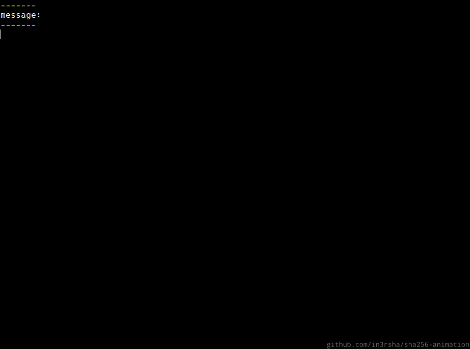

## Usage

Just run the `sha256.rb` script with the data you want to see hashed.

```
# simple
ruby sha256.rb abc

# hash binary or hex data by using `0b` or `0x` prefixes
ruby sha256.rb 0b01100001
ruby sha256.rb 0xaabbccdd

# hash a file (be aware that files will have a newline character at the end)
ruby sha256.rb file.txt

# speed up or step through the animation (optional)
ruby sha256.rb abc normal # default
ruby sha256.rb abc fast
ruby sha256.rb abc enter
```

You can also run the individual functions used in SHA-256 by passing in binary strings as arguments:

```
ruby shr.rb 11111111111111110000000000000000 22
ruby rotr.rb 11111111111111110000000000000000 22
ruby sigma0.rb 11111111111111110000000000000000
ruby sigma1.rb 11111111111111110000000000000000
ruby usigma0.rb 11111111111111110000000000000000
ruby usigma1.rb 11111111111111110000000000000000
ruby ch.rb 11111111111111110000000000000000 11110000111100001111000011110000 00000000000000001111111111111111
ruby maj.rb 11111111111111110000000000000000 11110000111100001111000011110000 00000000000000001111111111111111
```

You can do double-SHA256 (e.g. [Bitcoin](https://learnmeabitcoin.com)) by using `hash256.rb`. This script accepts _hex data_ (e.g. [block headers](https://learnmeabitcoin.com/technical/block/#header), [transaction data](https://learnmeabitcoin.com/technical/transaction/)) by default.

```
ruby hash256.rb 0100000000000000000000000000000000000000000000000000000000000000000000003ba3edfd7a7b12b27ac72c3e67768f617fc81bc3888a51323a9fb8aa4b1e5e4a29ab5f49ffff001d1dac2b7c # genesis block header
```

## How does SHA-256 work?

The [<abbr title="National Institute of Standards and Technology">NIST</abbr> specification](https://nvlpubs.nist.gov/nistpubs/FIPS/NIST.FIPS.180-4.pdf) contains a precise explanation of SHA-256. The following is essentially a visualised summary of that document.


### 1. Definitions

The official specification begins with a number of definitions, but seeing as this is a simplified explanation, all I want you to know is:

* `bit` = `0` or `1` (the smallest unit of storage on a computer)
* `word` = 32 bits

Also, [bitwise operations](https://www.calleerlandsson.com/rubys-bitwise-operators/) use the following symbols:

```
OR  = |
XOR = ^
AND = &
NOT = ~
```

### 2. Operations

SHA-256 uses four basic bitwise operations on `words`.

#### Right Shift ([`shr.rb`](shr.rb))

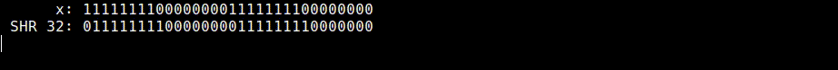

<pre>
SHR<sup>n</sup>(x) = x >> n
</pre>

Move bits a number of positions to the right. The bits shifted off the right-hand side are lost.

#### Rotate Right ([`rotr.rb`](rotr.rb))

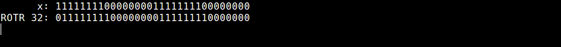

<pre>
ROTR<sup>n</sup>(x) = (x >> n) | (x << 32-n)
</pre>

Move bits a number of positions to the right, and place the shifted bits on the left-hand side. This can also be referred to as a _circular right shift_.

#### Exclusive Or ([`xor.rb`](xor.rb))

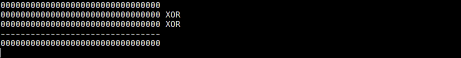

<pre>
x ^ y ^ z
</pre>

The `XOR` bitwise operator takes two input bits, and outputs a `1` if _only one_ of them is a `1`. This is useful for getting a _balanced representation of multiple bits_ when merging them together via multiple `XOR` operations.

#### Addition ([`add.rb`](add.rb))

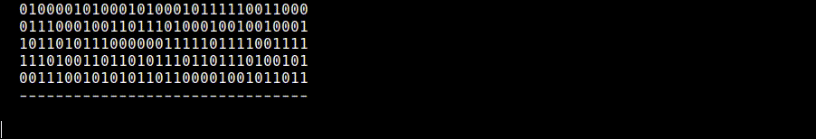

<pre>
(v + w + x + y + z) % 2<sup>32</sup>
</pre>

This is standard integer addition, but we constrain the result to a 32 bit number by taking the result **modulus 2<sup>32</sup>**.


### 3. Functions

The operations above can be combined to create functions.

The first four functions are named using the Greek symbol **Sigma** (lowercase `σ` and uppercase `Σ`). This is for no particular reason, it's just so we can give names to some combined operations.

I like to think of these as the "rotational" functions.

#### σ0 ([`sigma0.rb`](sigma0.rb))

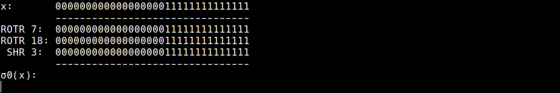

<pre>
σ<sub>0</sub>(x) = ROTR<sup>7</sup>(x) ^ ROTR<sup>18</sup>(x) ^ SHR<sup>3</sup>(x)
</pre> <!-- σ0(x) = ROTR(7, x) ^ ROTR(18, x) ^ SHR(3, x) -->

#### σ1 ([`sigma1.rb`](sigma1.rb))

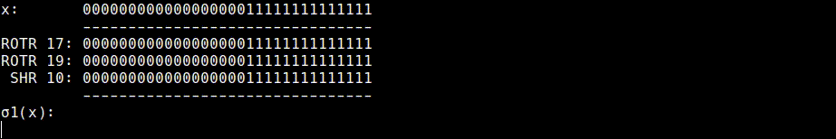

<pre>
σ<sub>1</sub>(x) = ROTR<sup>17</sup>(x) ^ ROTR<sup>19</sup>(x) ^ SHR<sup>10</sup>(x)
</pre> <!-- σ1(x) = ROTR(17, x) ^ ROTR(19, x) ^ SHR(10, x) -->


#### Σ0 ([`usigma0.rb`](usigma0.rb))


<pre>
Σ<sub>0</sub>(x) = ROTR<sup>2</sup>(x) ^ ROTR<sup>13</sup>(x) ^ ROTR<sup>22</sup>(x)
</pre> <!-- Σ0(x) = ROTR(2, x) ^ ROTR(13, x) ^ ROTR(22, x) -->

#### Σ1 ([`usigma1.rb`](usigma1.rb))

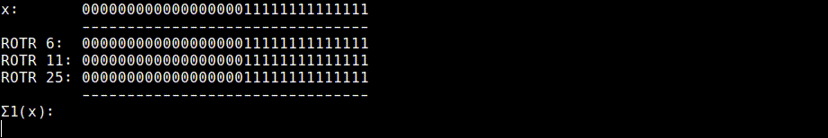

<pre>
Σ<sub>1</sub>(x) = ROTR<sup>6</sup>(x) ^ ROTR<sup>11</sup>(x) ^ ROTR<sup>25</sup>(x)
</pre> <!-- Σ1(x) = ROTR(6, x) ^ ROTR(11, x) ^ ROTR(25, x) -->

The last two functions of **Choice** and **Majority** accept three different inputs.

#### Choice ([`ch.rb`](ch.rb))

This function uses the `x` bit to **choose** between the `y` and `z` bits. It chooses the `y` bit if `x=1`, and chooses the `z` bit if `x=0`.


```
Ch(x, y, z) = (x & y) ^ (~x & z)
```

#### Majority ([`maj.rb`](maj.rb))

This function returns the **majority** of the three bits.

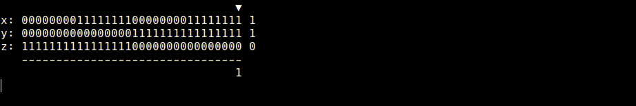

```
Maj(x, y, z) = (x & y) ^ (x & z) ^ (y & z)
```


### 4. Constants ([`constants.rb`](constants.rb))

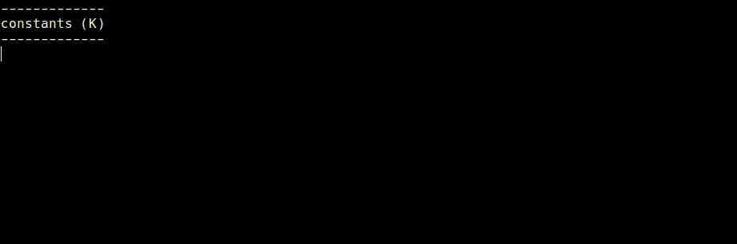

<pre>
K<sub>t</sub> = ∛primes <em>(first 32 bits of fractional part)</em>
</pre>

SHA-256 uses sixty four constants <code>K<sub>t</sub></code> to help with mixing up the bits during the main hash computation. These constants are generated by taking the **cube root** of the first sixty four **prime numbers**.

The _fractional parts_ of these cube roots are irrational (they go on forever), so they make for a good selection of random bits to use at constants. This is better than using specifically chosen constants, as this makes it less likely that the hash function has been designed with a back-door.

Anyway, to get _32 bits_ from these numbers, we take the fractional part and multiply it by 2<sup>32</sup>, and use the resulting _integer_ as the constant.

---

Now that we've defined the functions and constants we're going to use, the next step is to _prepare the message_ for hashing.

### 5. Message ([`message.rb`](message.rb))

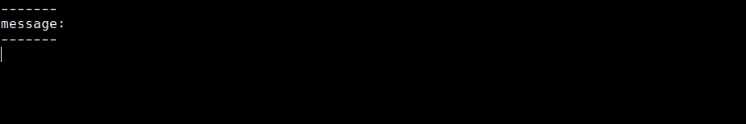

As you may have noticed, SHA-256 operates on the individual _bits_ of data. So we before we can hash any data, we first of all need to convert it to its binary representation (`1`s and `0`s).

For example when hashing a _string_, we convert each character to its corresponding number in the [ASCII table](https://www.cs.cmu.edu/~pattis/15-1XX/common/handouts/ascii.html). These numbers are converted to binary, and it's this binary data that we use as the input to the hash function.


### 6. Padding ([`padding.rb`](padding.rb))

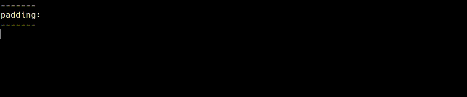

The SHA-256 hash function works on data in 512-bit chunks, so all messages need to be _padded_ with zeros up to the nearest multiple of 512 bits.

Furthermore, to prevent similar inputs from hashing to the same result, we separate the message from the zeros with a `1` bit, and also include the size of the message in the last 64 bits of the padding.

_**NOTE:** This method of separating the message with a `1` and including the message size in the padding is known as **Merkle–Damgård strengthening** (MD strengthening)._


### 7. Message Blocks ([`blocks.rb`](blocks.rb))

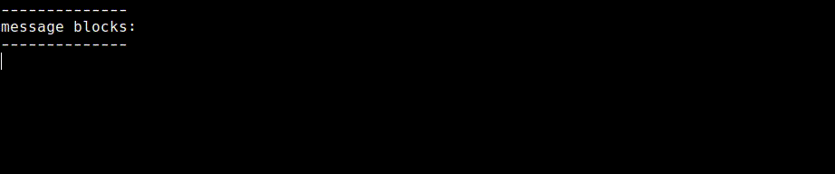

After the message has been padded, we cut it in to equal 512-bit **message blocks** <code>M<sup>i</sup></code> to be processed by the hash function. (There is only one message block for this example message, so the animation above isn't very interesting.)

Each of these message blocks can also be further split in to 16 words <code>M<sup>i</sup><sub>j</sub></code> (`512 / 32 = 16 words`), which will come in handy in just a moment.

---

Now that we have padded our message and cut it in to equal chunks, we put _each of the message blocks_ through the main hash function.

### 8. Message Schedule ([`schedule.rb`](schedule.rb), [`expansion.rb`](expansion.rb))

For each message block we create a sixty-four word **message schedule** <code>W<sub>t</sub></code>.

The first sixteen words of this message schedule are constructed from the message block.

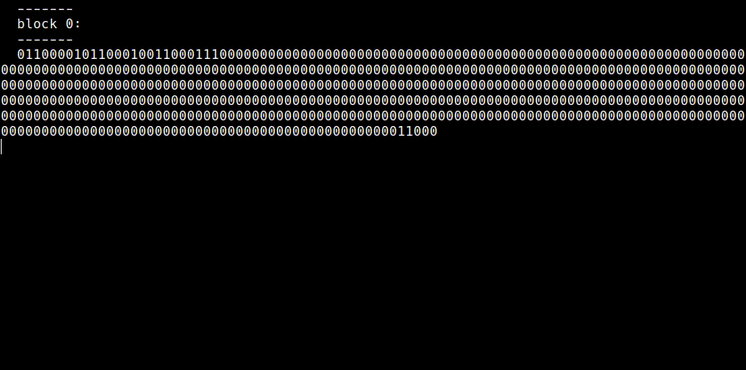

<pre>
W<sub>t</sub> = M<sup>i</sup><sub>t</sub>

<em>(for 0 ≤ t ≤ 15)</em>
</pre>

This is then _expanded_ to a total of sixty four words by applying rotational functions to some of the words _already in the schedule_.

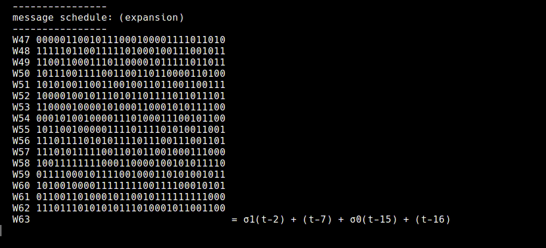

<pre>
W<sub>t</sub> = σ<sub>1</sub>(W<sub>t-2</sub>) + W<sub>t-7</sub> + σ<sub>0</sub>(W<sub>t-15</sub>) + W<sub>t-16</sub>

<em>(for 16 ≤ t ≤ 63)</em>
</pre>


### 9. Initial Hash Value ([`initial.rb`](initial.rb))

The hash function begins by setting the **initial hash value** <code>H<sup>0</sup></code> in the _state registers_ (`a`, `b`, `c`, `d`, `e`, `f`, `g`, `h`).

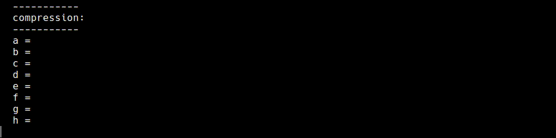

<pre>
H<sup>0</sup> = √primes <em>(first 32 bits of fractional part)</em>
</pre>

Like the constants, the initial hash value uses the fractional part of the **square root** of the first eight **prime numbers**. This gives us a random set of bits that we can use as a platform to begin the hash computation.


### 10. Compression Function

This is the heart of the hash function.

For each word in the message schedule, we use the current values in the state registers to calculate two new **temporary words** (<code>T<sub>1</sub></code> and <code>T<sub>2</sub></code>).

#### Temporary Word 1 ([`t1.rb`](t1.rb))

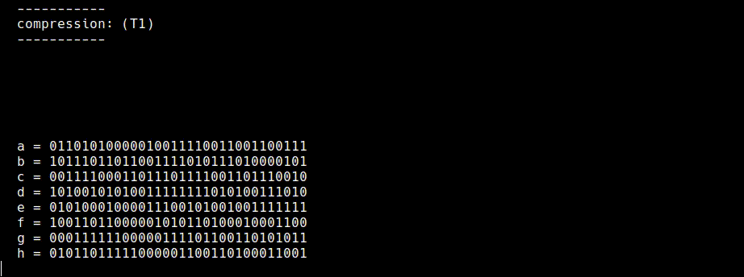

<pre>
T<sub>1</sub> = Σ<sub>1</sub>(e) + Ch(e, f, g) + h + K<sub>t</sub> + W<sub>t</sub>
</pre>

This temporary word takes the next **word in the message schedule** along with the next **constant from the list**. These values added to a <code>Σ<sub>1</sub></code> rotation of the _fifth_ value in the state register, the `choice` of the values in the _last three_ registers, and the value of the _last_ register on its own.

#### Temporary Word 2 ([`t2.rb`](t2.rb))

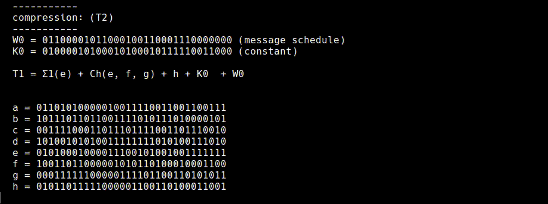

<pre>
T<sub>2</sub> = Σ<sub>0</sub>(a) + Maj(a, b, c)
</pre>

This temporary word is calculated by adding a <code>Σ<sub>0</sub></code> rotation of the _first_ value in the state register to a `majority` of the values in the _first three_ registers.

#### Compression ([`compression.rb`](compression.rb))

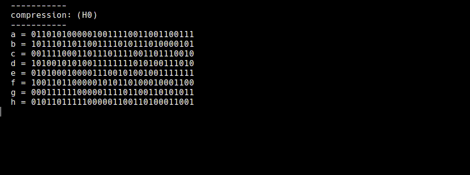

After calculating the two temporary words, we shift each value in the state registers down one position, and update the following registers:

* The _first_ value in the state register becomes <code>T<sub>1</sub></code> + <code>T<sub>2</sub></code>.
* The _fifth_ value in the state register has <code>T<sub>1</sub></code> added to it.

This is one "round" of compression, and is repeated for every word in the message schedule.

After we have compressed the entire message schedule, we **add** the resulting hash value to the initial hash value we started with. This gives us the final hash value for this message block.

---

If there are further message blocks to be processed, the current hash value will be used as the _initial hash value_ in the next compression.

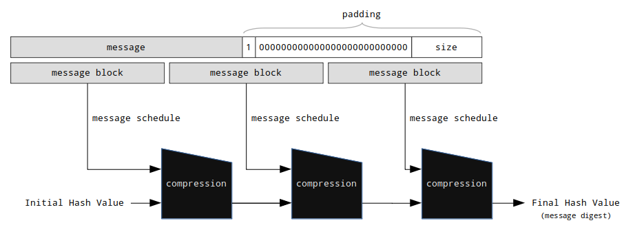

_**NOTE:** This process of applying a compression function to each message block and using the output as the input for the next compression is known as the **Merkle–Damgård construction**._

### 11. Final Hash Value ([`final.rb`](final.rb))


We will be left with eight 32-bit values in the state registers after applying the compression function to each message block.

The final hash value is just the _concatenation_ of these eight 32-bit values to produce a 256-bit **message digest**. For compactness this message digest is usually shown in hexadecimal.


## Notes

* This isn't the prettiest code I've ever written.
* These scripts redraw the entire terminal screen for every frame of the animation, so the display can become disjointed at faster speeds.
* All of the actual code for calculating SHA-256 hashes can be found in [`sha256lib.rb`](sha256lib.rb), all of the other files are animations.
* I decided not to include the individual animations for [`expansion.rb`](expansion.rb), [`t1.rb`](t1.rb), [`t2.rb`](t2.rb) in the main [`sha256.rb`](sha256.rb) animation. This is to help speed up the flow of the animation.
* In terms of security; I believe the **Sigma** functions help with the _diffusion of bits_, and the **Choice** and **Majority** functions give the hash function it's _one-wayness_ due to being _nonlinear_. The **addition modulus 2<sup>32</sup>** is also _nonlinear_.<sup>[1](#security)</sup>


## Testimonials

> that's dope - [esky33](https://twitter.com/Esky33junglist/status/1259789790943285248?s=20)
<br>

## Links

* [FIPS 180-4](https://nvlpubs.nist.gov/nistpubs/FIPS/NIST.FIPS.180-4.pdf) - The official specification for the SHA-2 family of hash functions, including SHA-256.
* [SHA-256 Examples](https://csrc.nist.gov/CSRC/media/Projects/Cryptographic-Standards-and-Guidelines/documents/examples/SHA256.pdf) - A couple of official hash examples to check your implementation with.
<br><br>
* [Security Analysis of SHA-256 and Sisters](https://link.springer.com/content/pdf/10.1007%2F978-3-540-24654-1_13.pdf) - A paper by Henri Gilbert and Helena Handschuh explaining some security details about SHA-256.
<!-- * [SHA-256 Ruby](https://github.com/nevizar/sha256_ruby/blob/master/sha256.rb) - A beautifully concise implementation of SHA-256 in Ruby. Was a great help when checking my code was working correctly. -->

### Footnotes

<small><em><a id="security">1</a>: Cryptography For Developers, Simon Johnson (pg. 218)</em></small>


